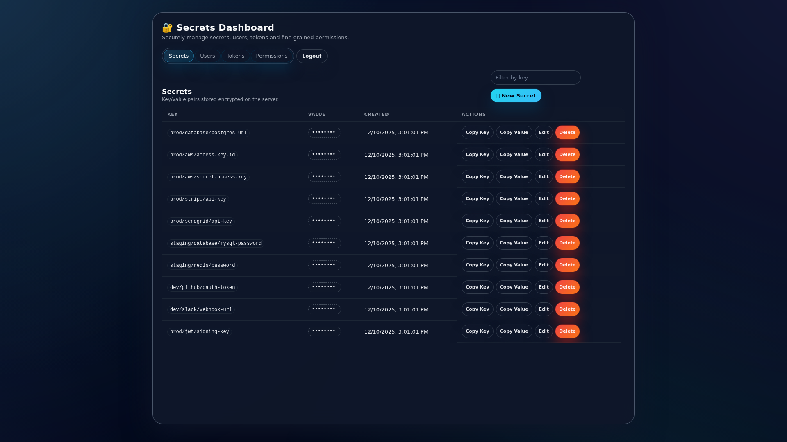
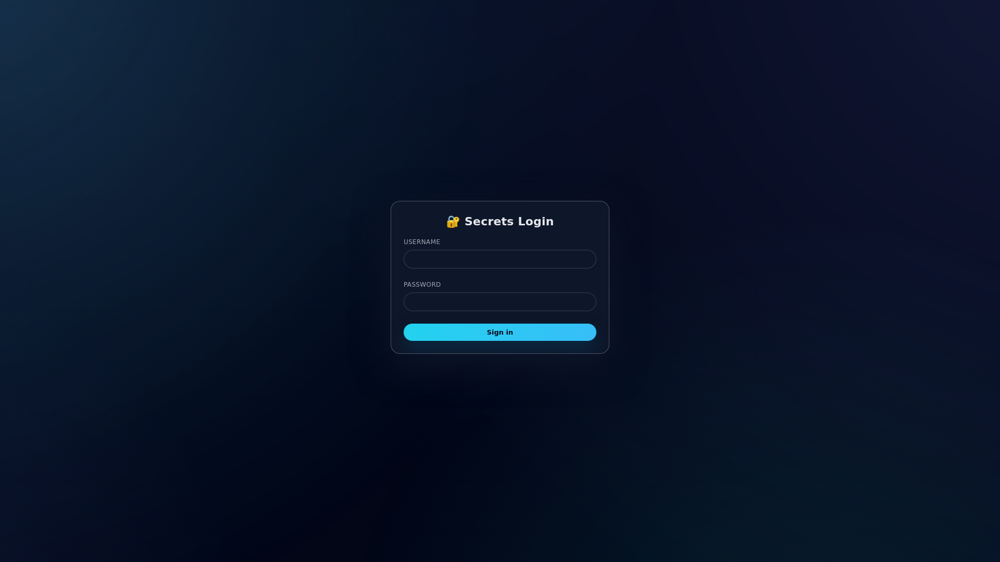
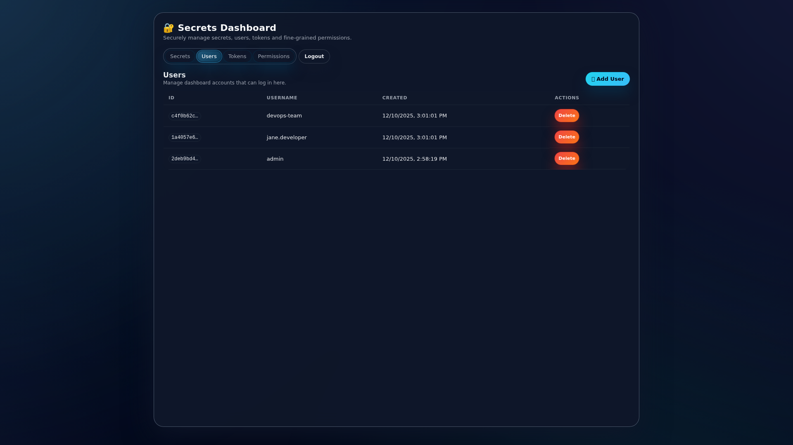
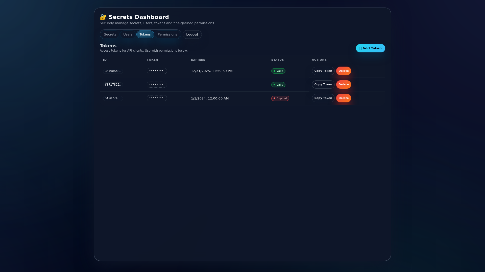
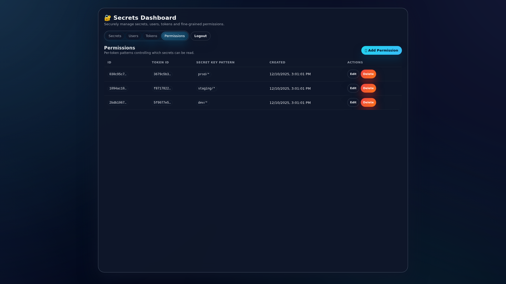

# 🔐 Secrets Manager

A modern, self-hosted secrets management solution with a beautiful web UI and REST API. Securely store and manage passwords, API keys, tokens, and other sensitive data with fine-grained access control.



## ✨ Features

- **🎨 Modern Web UI** - Beautiful, responsive dashboard with dark mode
- **🔒 Secure Storage** - All secrets are base64-encoded and stored in SQLite
- **👥 User Management** - Multi-user support with authentication
- **🎫 API Tokens** - Generate tokens for programmatic access
- **🛡️ Fine-Grained Permissions** - Pattern-based access control for secrets
- **🔑 JWT Authentication** - Secure session management
- **📝 Audit Logging** - Track all operations on secrets and users
- **🚀 Self-Hosted** - Full control over your sensitive data
- **📦 Single Binary** - Easy deployment with no external dependencies

## 📸 Screenshots

### Login Page


### Secrets Dashboard - Realistic Production Data
Manage secrets for multiple environments (prod, staging, dev) with organized key naming:


### Secret Value Revealed
View and copy sensitive values like database connection strings, API keys, and credentials:


### User Management
Control dashboard access with multiple user accounts for team collaboration:


### API Tokens with Expiration
Generate tokens for programmatic access with expiration tracking:


### Fine-Grained Permissions
Control access to secrets using pattern matching (prod/*, staging/*, dev/*):


## 🚀 Quick Start

### Installation

#### Using Go Install
```bash
go install github.com/tomek7667/secrets/cmd/secretsserver@latest
```

#### Build from Source
```bash
git clone https://github.com/tomek7667/secrets.git
cd secrets
go build ./cmd/secretsserver
```

### Running the Server

```bash
# Run with default settings
secretsserver

# Or with custom configuration
secretsserver --address 0.0.0.0:8080 --db-path /var/lib/secrets/db.sqlite
```

The server will start on `http://127.0.0.1:7770` by default.

On first run, an admin user is automatically created. The credentials will be logged to the console:
- Username: `admin`
- Password: (randomly generated or use `--admin-password` flag)

### Access the Dashboard

1. Open your browser to `http://127.0.0.1:7770`
2. Log in with the admin credentials
3. Start managing your secrets!

## ⚙️ Configuration

### Environment Variables

| Variable | Default | Description |
|----------|---------|-------------|
| `SECRETS_ADDRESS` | `127.0.0.1:7770` | Server listen address |
| `SECRETS_DB_PATH` | `./secrets.sqlite` | Path to SQLite database file |
| `SECRETS_JWT_SECRET` | (auto-generated) | JWT signing secret |
| `SECRETS_ADMIN_PASSWORD` | (auto-generated) | Initial admin password |
| `ALLOWED_ORIGINS` | (none) | Comma-separated CORS origins |

### Command Line Flags

```bash
secretsserver --help

Flags:
  --address string           listen address (default "127.0.0.1:7770")
  --db-path string          path to sqlite db (default "./secrets.sqlite")
  --allowed-origins string  comma-separated list of allowed CORS origins
  --jwt-secret string       jwt secret used for users session
  --admin-password string   admin user password (generated randomly if not provided)
```

### Example with Environment Variables

```bash
export SECRETS_ADDRESS="0.0.0.0:8080"
export SECRETS_DB_PATH="/var/lib/secrets/secrets.db"
export SECRETS_ADMIN_PASSWORD="YourSecurePassword123!"
export ALLOWED_ORIGINS="https://secrets.example.com"

secretsserver
```

## 📚 Usage Guide

### Managing Secrets

1. **Create a Secret**
   - Click "New Secret" button
   - Enter a key (e.g., `aws/prod/db-password`)
   - Enter the secret value
   - Click "Create"

2. **View Secrets**
   - Secret values are hidden by default (shown as `••••••••`)
   - Click on the hidden value to reveal it
   - Use the filter box to search by key

3. **Copy Secrets**
   - Use "Copy Key" to copy the secret name
   - Use "Copy Value" to copy the secret value

4. **Edit/Delete Secrets**
   - Click "Edit" to update a secret value
   - Click "Delete" to remove a secret

### Managing Users

1. Navigate to the "Users" tab
2. Click "Add User" to create new dashboard accounts
3. Each user can log in and manage secrets

### Managing API Tokens

1. Navigate to the "Tokens" tab
2. Click "Add Token" to create a new API token
3. Optionally set an expiration date
4. Copy the token value for use in API requests

### Managing Permissions

Permissions control which secrets an API token can access using pattern matching:

1. Navigate to the "Permissions" tab
2. Click "Add Permission"
3. Select a token
4. Enter a pattern:
   - `*` - Access all secrets
   - `aws/*` - Access all secrets starting with "aws/"
   - `exact-key` - Access only the exact key

## 🔌 API Documentation

### Authentication

#### Login
```bash
POST /login
Content-Type: application/json

{
  "username": "admin",
  "password": "your-password"
}

# Response
{
  "data": {
    "token": "eyJhbGc..."
  }
}
```

### Secrets API (Requires JWT)

#### List All Secrets
```bash
GET /api/secrets
Authorization: Bearer <jwt-token>
```

#### Create Secret
```bash
POST /api/secrets
Authorization: Bearer <jwt-token>
Content-Type: application/json

{
  "key": "my-secret",
  "value": "secret-value"
}
```

#### Update Secret
```bash
PUT /api/secrets?key=my-secret
Authorization: Bearer <jwt-token>
Content-Type: application/json

{
  "value": "new-secret-value"
}
```

#### Delete Secret
```bash
DELETE /api/secrets?key=my-secret
Authorization: Bearer <jwt-token>
```

### Get Secret with API Token

```bash
GET /api/secrets/get?key=my-secret
Authorization: Api <token-value>
```

**Note**: This endpoint uses API tokens (not JWT) and requires appropriate permissions.

### Users API

```bash
# List users
GET /api/users
Authorization: Bearer <jwt-token>

# Create user
POST /api/users
Authorization: Bearer <jwt-token>
Content-Type: application/json
{
  "username": "newuser",
  "password": "password"
}

# Update user password
PUT /api/users/{id}
Authorization: Bearer <jwt-token>
Content-Type: application/json
{
  "password": "newpassword"
}

# Delete user
DELETE /api/users/{id}
Authorization: Bearer <jwt-token>
```

### Tokens API

```bash
# List tokens
GET /api/tokens
Authorization: Bearer <jwt-token>

# Create token
POST /api/tokens
Authorization: Bearer <jwt-token>
Content-Type: application/json
{
  "token": "my-api-token-123",
  "expires_at": "2025-12-31T23:59:59Z"  // optional
}

# Update token expiration
PUT /api/tokens/{id}
Authorization: Bearer <jwt-token>
Content-Type: application/json
{
  "expires_at": "2026-01-01T00:00:00Z"
}

# Delete token
DELETE /api/tokens/{id}
Authorization: Bearer <jwt-token>
```

### Permissions API

```bash
# List permissions
GET /api/permissions
Authorization: Bearer <jwt-token>

# Create permission
POST /api/permissions
Authorization: Bearer <jwt-token>
Content-Type: application/json
{
  "token_id": "token-uuid",
  "secret_key_pattern": "aws/*"
}

# Update permission
PUT /api/permissions/{id}
Authorization: Bearer <jwt-token>
Content-Type: application/json
{
  "secret_key_pattern": "prod/*"
}

# Delete permission
DELETE /api/permissions/{id}
Authorization: Bearer <jwt-token>
```

## 🛠️ Development

### Prerequisites

- Go 1.25.4 or later
- Node.js 22+ (for running Bruno tests)

### Setup

```bash
# Clone the repository
git clone https://github.com/tomek7667/secrets.git
cd secrets

# Install dependencies
go mod download

# Run the server
go run cmd/secretsserver/main.go --admin-password "DevPassword123!"
```

### Building

```bash
# Build for current platform
go build ./cmd/secretsserver

# Build for specific platform
GOOS=linux GOARCH=amd64 go build ./cmd/secretsserver
```

### Testing

The project uses Bruno CLI for integration testing:

```bash
# Install Bruno CLI
npm install -g @usebruno/cli

# Start the server
go run cmd/secretsserver/main.go --admin-password "TestAdminPassword123!" &

# Run all integration tests
cd bruno/auth_integration_tests && bru run --env local
cd bruno/secrets_integration_tests && bru run --env local
cd bruno/users_tokens_integration_tests && bru run --env local
```

### Project Structure

```
secrets/
├── cmd/
│   └── secretsserver/      # Main application entry point
├── internal/
│   ├── secrets/            # HTTP handlers and business logic
│   ├── sqlite/             # Database client
│   └── sqlc/               # Generated SQL code
├── schema/                 # Database migrations
├── queries/                # SQL queries for sqlc
├── bruno/                  # API integration tests
└── README.md
```

## 🔍 Pattern Matching

Permissions use simple wildcard pattern matching:

- `*` - Matches everything
- `prefix/*` - Matches anything starting with "prefix/"
- `exact-match` - Matches only the exact string

Examples:
- Pattern `aws/*` matches: `aws/key1`, `aws/prod/db`, `aws/dev/api-key`
- Pattern `prod/*` matches: `prod/secret`, `prod/api/key`
- Pattern `github-token` matches: only `github-token`

## 🤝 Contributing

Contributions are welcome! Please feel free to submit issues and pull requests.

## 📝 License

This project is open source. Please check the repository for license information.

## 🙏 Acknowledgments

Built with:
- [Go](https://golang.org/) - Programming language
- [Chi](https://github.com/go-chi/chi) - HTTP router
- [SQLite](https://www.sqlite.org/) - Database
- [sqlc](https://sqlc.dev/) - SQL code generator
- [Bruno](https://www.usebruno.com/) - API testing

---

Made with ❤️ for secure secrets management
